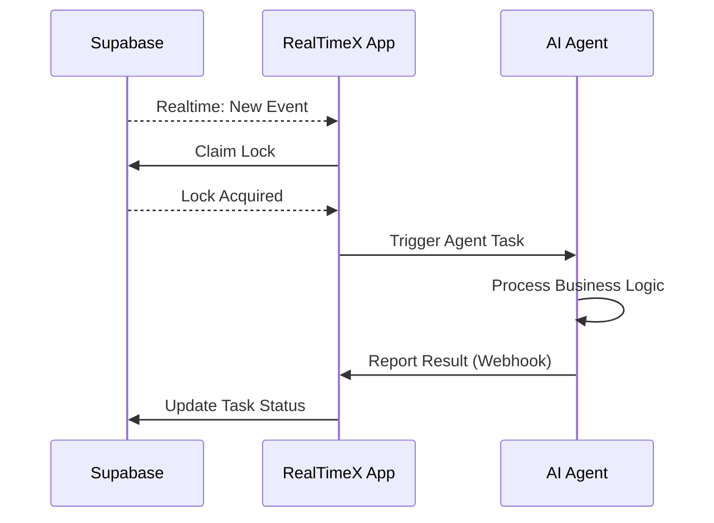

import { Callout, Cards, Card } from 'nextra/components'
import Image from 'next/image'

# Local Apps Overview

**Local Apps** is a powerful feature in RealTimeX that enables you to connect local applications running on your machine to the AI Agent system. When events occur in your database (Supabase), RealTimeX can automatically trigger AI Agents to process tasks or create calendar events for manual review.

<Callout type="info">
Local Apps requires **RealTimeX Desktop** (v1.0.53+) and a **Supabase** project.
</Callout>

## What is a Local App?

A Local App is an application running on your local machine that integrates with the RealTimeX system. It can:

- **Listen to database events** - Monitor changes in your Supabase database in real-time
- **Trigger AI Agents automatically** - Process tasks immediately when new events occur
- **Create calendar events** - Allow you to review and manually trigger agents when needed
- **Run distributed** - Multiple machines can listen and process tasks simultaneously
- **Ensure reliability** - Lock mechanism prevents duplicate processing

## Quick Start (Compatible Mode)

Setting up a Local App takes just a few steps:

1. **Add New App** - Go to Settings → Local Apps → Add new app
2. **Enter Supabase Credentials** - Provide your Supabase URL and Anon Key
3. **Login & Auto-Setup** - Login via Supabase CLI and click Auto-Setup Schema
4. **Configure Agent** - Select which AI Agent handles incoming tasks
5. **Save & Start** - Your Local App is ready to process events!

<Callout type="success">
**No Manual SQL Required!** RealTimeX now automatically creates all required tables and functions when you click **Auto-Setup Schema**.
</Callout>

## Two Operating Modes

### 1. Compatible Mode (Recommended)

| Feature | Description |
|---------|-------------|
| **Setup** | Automatic - Login to Supabase + one-click schema setup |
| **Table** | Uses standard `activities` table |
| **Lock Logic** | Built-in via Supabase RPC functions |
| **Best For** | New projects, fast prototyping, most use cases |

### 2. Custom Mode (Advanced)

| Feature | Description |
|---------|-------------|
| **Setup** | Manual - Implement custom API endpoints |
| **Table** | Use your existing database tables |
| **Lock Logic** | Your Local App controls via API |
| **Best For** | Enterprise systems, CRM/ERP integrations |

## System Architecture

## Key Features

### 🔐 Automatic Schema Setup

No more manual SQL! RealTimeX uses the Supabase CLI to automatically create:
- `activities` table with all required columns
- RPC functions for task claiming and completion
- Indexes for optimal performance
- Realtime publication for event streaming

### 🔄 Distributed Lock Mechanism

When multiple machines are listening:
- Only **one machine processes each task**
- Other machines wait for the next available task
- **Stale lock recovery** handles crashed processes
- No duplicate processing or race conditions

### 🔔 Real-time Event Processing

Events are processed instantly thanks to Supabase Realtime:
- INSERT - New records trigger agents
- UPDATE - Changed records can be reprocessed
- Filter by status, priority, or any column

## Use Cases

| Use Case | Description |
|----------|-------------|
| **Customer Support** | Auto-categorize and respond to support tickets |
| **Content Processing** | Extract data from uploaded documents |
| **Order Processing** | Validate and fulfill new orders |
| **Data Enrichment** | Enrich contact profiles with external data |
| **Notification System** | Send alerts based on database changes |

## Next Steps

- [**User Guide**](./user-guide) - Step-by-step setup with screenshots
- [**Developer Guide**](./developer-guide) - Use the SDK and implement Custom Mode
- [**Agent Developer**](./agent-developer) - Build agents that respond to local events
