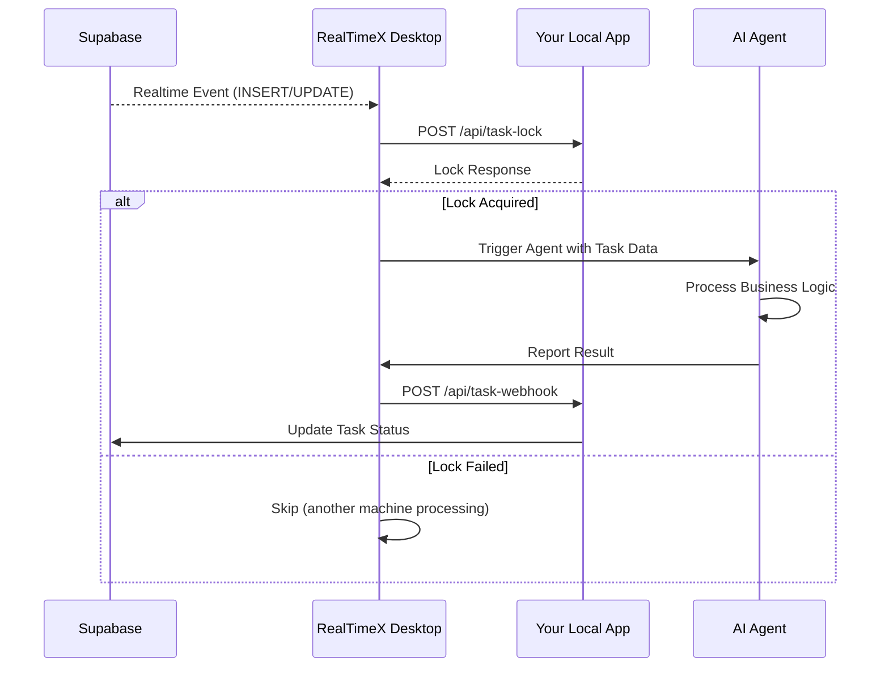

import { Callout, Tabs } from 'nextra/components'

# Local Apps Developer Guide

This guide covers how to integrate your applications with RealTimeX using the official SDKs.

## Prerequisites

Before using the SDK, ensure your Supabase database is set up via the Main App:

1. Open **RealTimeX** → **Settings** → **Local Apps**
2. Create or configure your Local App
3. Enter Supabase **URL** and **Anon Key**
4. Select **Compatible Mode** → **Login to Supabase** → **Auto-Setup Schema**

<Callout type="info">
Schema setup is handled entirely by the Main App. **No manual SQL required.**
</Callout>

## Installation

<Tabs items={['TypeScript', 'Python']}>
  <Tabs.Tab>
    ```bash
    npm install @realtimex/sdk
    ```
  </Tabs.Tab>
  <Tabs.Tab>
    ```bash
    pip install realtimex-sdk
    ```
  </Tabs.Tab>
</Tabs>

## Demo Examples

Check out our complete demo applications showcasing all SDK features:

👉 **[GitHub: local-app-examples](https://github.com/therealtimex/local-app-examples)**

| Example | Language | Description |
|---------|----------|-------------|
| `nodejs-app` | TypeScript + Express | Full-featured demo with TailwindCSS UI |
| `python-app` | Python + NiceGUI | Interactive demo with real-time UI |

## Quick Start

When you start your Local App from the RealTimeX Main App, environment variables `RTX_APP_ID` and `RTX_APP_NAME` are automatically set. The SDK auto-detects these.

<Tabs items={['TypeScript', 'Python']}>
  <Tabs.Tab>
    ```typescript
    import { RealtimeXSDK } from '@realtimex/local-app-sdk';

    // No config needed - auto-detects from environment
    const sdk = new RealtimeXSDK();

    // Insert activity
    const activity = await sdk.activities.insert({
      type: 'new_lead',
      email: 'user@example.com',
    });

    // Trigger agent
    await sdk.webhook.triggerAgent({
      raw_data: activity,
      auto_run: true,
      agent_name: 'processor',
      workspace_slug: 'sales',
      thread_slug: 'general', // or "create_
      prompt: 'Please look into this activity.' // Optional
    });
    ```
  </Tabs.Tab>
  <Tabs.Tab>
    ```python
    from realtimex_sdk import RealtimeXSDK

    # No config needed - auto-detects from environment
    sdk = RealtimeXSDK()

    # Insert activity
    activity = await sdk.activities.insert({
        "type": "new_lead",
        "email": "user@example.com"
    })

    # Trigger agent
    await sdk.webhook.trigger_agent(
        raw_data=activity,
        auto_run=True,
        agent_name="processor",
        workspace_slug="sales",
        thread_slug="general" # or "create_new" to create new thread
        prompt="Please look into this activity." # Optional
    )
    ```
  </Tabs.Tab>
</Tabs>

---

## SDK Features

### Activities CRUD

Manage your `activities` table directly through the SDK without direct database access.

<Tabs items={['TypeScript', 'Python']}>
  <Tabs.Tab>
    ```typescript
    // Insert new activity
    const activity = await sdk.activities.insert({
      type: 'order',
      amount: 100
    });

    // List activities with filters
    const pending = await sdk.activities.list({
      status: 'pending',
      limit: 10
    });

    // Get single activity
    const item = await sdk.activities.get('activity-uuid');

    // Update activity
    await sdk.activities.update('activity-uuid', {
      status: 'processed'
    });

    // Delete activity
    await sdk.activities.delete('activity-uuid');
    ```
  </Tabs.Tab>
  <Tabs.Tab>
    ```python
    # Insert new activity
    activity = await sdk.activities.insert({
        "type": "order",
        "amount": 100
    })

    # List activities with filters
    pending = await sdk.activities.list(
        status="pending",
        limit=10
    )

    # Get single activity
    item = await sdk.activities.get("activity-uuid")

    # Update activity
    await sdk.activities.update("activity-uuid", {
        "status": "processed"
    })

    # Delete activity
    await sdk.activities.delete("activity-uuid")
    ```
  </Tabs.Tab>
</Tabs>

### Webhook & Agent Triggering

Trigger AI Agents to process data either manually or automatically.

<Tabs items={['TypeScript', 'Python']}>
  <Tabs.Tab>
    ```typescript
    // Manual Mode (Default) - Creates calendar event for review
    await sdk.webhook.triggerAgent({
      raw_data: { email: 'user@example.com' },
    });

    // Auto-run Mode - Triggers agent immediately
    await sdk.webhook.triggerAgent({
      raw_data: activity,
      auto_run: true,
      agent_name: 'pdf-processor',
      workspace_slug: 'operations',
      thread_slug: 'general', // or "create_new" to create new thread
      prompt: 'Summarize this file' // Optional
    });
    ```
  </Tabs.Tab>
  <Tabs.Tab>
    ```python
    # Manual Mode (Default)
    await sdk.webhook.trigger_agent(
        raw_data={"email": "user@example.com"}
    )

    # Auto-run Mode
    await sdk.webhook.trigger_agent(
        raw_data=activity,
        auto_run=True,
        agent_name="pdf-processor",
        workspace_slug="operations",
        thread_slug="general", // or "create_new" to create new thread
        prompt="Summarize this file"
    )
    ```
  </Tabs.Tab>
</Tabs>

### Public Metadata API

Access RealTimeX system metadata like available agents and workspaces.

<Tabs items={['TypeScript', 'Python']}>
  <Tabs.Tab>
    ```typescript
    const agents = await sdk.api.getAgents();
    const workspaces = await sdk.api.getWorkspaces();
    const threads = await sdk.api.getThreads('workspace-slug');
    const taskStatus = await sdk.api.getTask('task-uuid');
    ```
  </Tabs.Tab>
  <Tabs.Tab>
    ```python
    agents = await sdk.api.get_agents()
    workspaces = await sdk.api.get_workspaces()
    threads = await sdk.api.get_threads("workspace-slug")
    task_status = await sdk.api.get_task("task-uuid")
    ```
  </Tabs.Tab>
</Tabs>

---

## Custom Mode Implementation

Custom Mode gives you full control over task locking and status management. Use this when you have existing database schemas or need custom distribution logic.

<Callout type="warning">
Custom Mode requires implementing API endpoints and database functions in your Local App. Recommended for advanced users with existing systems.
</Callout>

### Data Flow Overview



### Step 1: Required Table Columns

Your Supabase table must include these columns for RealTimeX to work:

```sql
-- Required columns
status TEXT DEFAULT 'pending'  -- Values: pending, claimed, processing, completed, failed
locked_by TEXT                  -- Machine ID that currently owns the task
locked_at TIMESTAMP WITH TIME ZONE  -- When the lock was acquired

-- Recommended columns for robust retry handling
attempted_by TEXT[] DEFAULT '{}'  -- Array of machine IDs that failed (prevents retry loops)
retry_count INTEGER DEFAULT 0     -- Number of retry attempts
error_message TEXT                -- Last error message
completed_at TIMESTAMP WITH TIME ZONE
result JSONB                      -- Task output data
```

### Step 2: Lock API Endpoint

Your Local App must implement this endpoint to handle lock requests:

**`POST /api/task-lock`**

```typescript
// Request Body
interface LockRequest {
  task_id: string;       // Supabase record ID
  table_name: string;    // e.g., "orders", "tickets"
  machine_id: string;    // Unique identifier for the requesting machine
  user_email: string;    // User email for tracking
}

// Success Response (HTTP 200)
interface LockSuccess {
  success: true;
  locked_by: string;
  locked_at: string;  // ISO timestamp
}

// Failure Response (HTTP 200)
interface LockFailure {
  success: false;
  reason: "already_locked" | "not_found" | string;
  locked_by?: string;
  locked_at?: string;
}
```

**Example Implementation (Express.js):**

```javascript
app.post('/api/task-lock', async (req, res) => {
  const { task_id, table_name, machine_id, user_email } = req.body;

  // Check if task is available
  const { data: task } = await supabase
    .from(table_name)
    .select('id, status, locked_by, locked_at, attempted_by')
    .eq('id', task_id)
    .single();

  if (!task) {
    return res.json({ success: false, reason: 'not_found' });
  }

  // Check if already locked (with 5-min timeout for stale locks)
  const isLocked = task.locked_by && 
    new Date(task.locked_at) > new Date(Date.now() - 5 * 60 * 1000);
  
  if (isLocked) {
    return res.json({ 
      success: false, 
      reason: 'already_locked',
      locked_by: task.locked_by,
      locked_at: task.locked_at
    });
  }

  // Prevent retry from machines that already failed
  if (task.attempted_by?.includes(machine_id)) {
    return res.json({ success: false, reason: 'already_attempted' });
  }

  // Acquire lock
  const { error } = await supabase
    .from(table_name)
    .update({
      status: 'claimed',
      locked_by: machine_id,
      locked_at: new Date().toISOString()
    })
    .eq('id', task_id);

  if (error) {
    return res.json({ success: false, reason: error.message });
  }

  res.json({
    success: true,
    locked_by: machine_id,
    locked_at: new Date().toISOString()
  });
});
```

### Step 3: Webhook API Endpoint

This endpoint receives task completion/failure reports from agents:

**`POST /api/task-webhook`**

```typescript
// Request Body
interface WebhookRequest {
  task_id: string;
  action: "complete" | "fail";
  machine_id: string;
  table_name: string;
  data: {
    result?: any;           // For complete action
    error?: { message: string };  // For fail action
  };
  timestamp: string;  // ISO timestamp
}

// Response (HTTP 200)
interface WebhookResponse {
  success: boolean;
}
```

**Example Implementation (Express.js):**

```javascript
app.post('/api/task-webhook', async (req, res) => {
  const { task_id, action, machine_id, table_name, data } = req.body;

  if (action === 'complete') {
    await supabase
      .from(table_name)
      .update({
        status: 'completed',
        result: data.result,
        completed_at: new Date().toISOString(),
        locked_by: null,
        locked_at: null
      })
      .eq('id', task_id);
  } else if (action === 'fail') {
    // Update status and add to attempted_by for retry prevention
    const { data: task } = await supabase
      .from(table_name)
      .select('attempted_by, retry_count')
      .eq('id', task_id)
      .single();

    await supabase
      .from(table_name)
      .update({
        status: 'failed',
        error_message: data.error?.message,
        attempted_by: [...(task.attempted_by || []), machine_id],
        retry_count: (task.retry_count || 0) + 1,
        locked_by: null,
        locked_at: null
      })
      .eq('id', task_id);

    // Optionally broadcast for retry by other machines
    await broadcastRetry(task_id, table_name, machine_id);
  }

  res.json({ success: true });
});
```

### Step 4: Retry Broadcast (Optional)

When a task fails, broadcast via Supabase Realtime so other machines can retry:

```javascript
async function broadcastRetry(taskId, tableName, failedBy) {
  const channel = supabase.channel(`task-retry-${APP_NAME}`);
  
  await channel.send({
    type: 'broadcast',
    event: 'task-available',
    payload: {
      task_id: taskId,
      table_name: tableName,
      failed_by: failedBy,
      retry_count: 1
    }
  });
}
```

### Step 5: Stale Lock Recovery (Critical!)

<Callout type="warning">
**This is CRITICAL!** When RealTimeX crashes, tasks remain locked indefinitely. You MUST implement stale lock recovery.
</Callout>

**Option A: Supabase pg_cron (Recommended)**

```sql
-- Enable pg_cron (Dashboard > Database > Extensions > pg_cron)
CREATE EXTENSION IF NOT EXISTS pg_cron;

-- Grant permissions
GRANT USAGE ON SCHEMA cron TO postgres;
GRANT ALL PRIVILEGES ON ALL TABLES IN SCHEMA cron TO postgres;

-- Create recovery function
CREATE OR REPLACE FUNCTION public.recover_stale_locks(
  target_table TEXT,
  timeout_minutes INT DEFAULT 5
)
RETURNS void AS $$
BEGIN
  EXECUTE format('
    UPDATE %I 
    SET 
      status = ''pending'', 
      locked_by = NULL, 
      locked_at = NULL
    WHERE status IN (''claimed'', ''processing'')
      AND locked_at < now() - interval ''%s minutes''
  ', target_table, timeout_minutes);
END;
$$ LANGUAGE plpgsql;

-- Schedule to run every minute
SELECT cron.schedule(
  'recover-stale-locks',
  '* * * * *',
  $$SELECT public.recover_stale_locks('your_table_name', 5);$$
);
```

**Option B: Local App Implementation**

```javascript
const STALE_THRESHOLD_MS = 5 * 60 * 1000; // 5 minutes
const CHECK_INTERVAL_MS = 60 * 1000; // 1 minute

async function recoverStaleLocks() {
  const cutoffTime = new Date(Date.now() - STALE_THRESHOLD_MS).toISOString();

  const { data: staleTasks } = await supabase
    .from(TABLE_NAME)
    .select('id, locked_by')
    .in('status', ['claimed', 'processing'])
    .lt('locked_at', cutoffTime);

  if (!staleTasks?.length) return;

  for (const task of staleTasks) {
    await supabase
      .from(TABLE_NAME)
      .update({
        status: 'pending',
        locked_by: null,
        locked_at: null
      })
      .eq('id', task.id);

    // Broadcast for retry
    await broadcastRetry(task.id, TABLE_NAME, task.locked_by);
  }
}

// Start on server startup
setInterval(recoverStaleLocks, CHECK_INTERVAL_MS);
recoverStaleLocks(); // Run immediately
```

### Step 6: Get Publications RPC (Required)

RealTimeX uses this function to discover which tables are enabled for Realtime:

```sql
CREATE OR REPLACE FUNCTION public.get_publications_full()
RETURNS json
LANGUAGE sql
STABLE
AS $$
WITH publication_tables AS (
  SELECT
    p.pubname,
    n.nspname AS child_schema,
    c.relname AS child_table
  FROM pg_publication p
  LEFT JOIN pg_publication_tables pt ON pt.pubname = p.pubname
  LEFT JOIN pg_class c ON c.relname = pt.tablename
  LEFT JOIN pg_namespace n ON n.oid = c.relnamespace
)
SELECT json_agg(
  jsonb_build_object(
    'pubname', pubname,
    'tables', (
      SELECT json_agg(jsonb_build_object('schema', child_schema, 'table', child_table))
      FROM publication_tables pt2 WHERE pt2.pubname = publication_tables.pubname
    )
  )
)
FROM (SELECT DISTINCT pubname FROM publication_tables) publication_tables;
$$;
```

### Step 7: Enable Realtime for Your Table

```sql
-- Enable replica identity for UPDATE event columns
ALTER TABLE public.your_table_name REPLICA IDENTITY FULL;

-- Add to Realtime publication
ALTER PUBLICATION supabase_realtime ADD TABLE public.your_table_name;
```

### Configuration in RealTimeX

After implementing the above, configure your Local App in RealTimeX Desktop:

1. **Mode**: Select **Custom**
2. **Tables**: Add your table name (e.g., `public.orders`)
3. **Lock URL**: `http://localhost:YOUR_PORT/api/task-lock`
4. **Webhook URL**: `http://localhost:YOUR_PORT/api/task-webhook`

---

## REST API Access

If you are not using one of our official SDKs, you can communicate with RealTimeX directly via our REST API.

👉 [View REST API Reference](/local-apps/api-reference)
