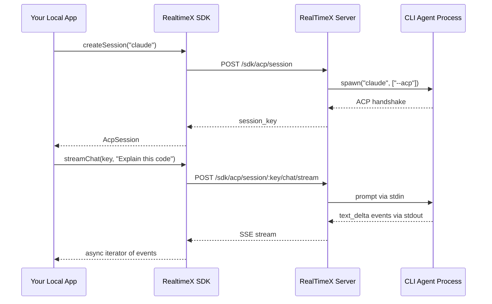
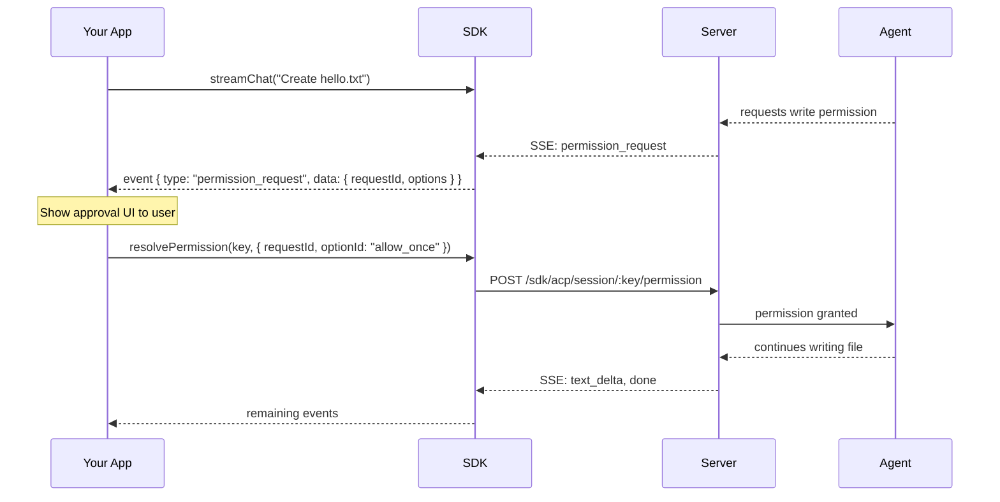

import { Callout, Tabs, Steps } from 'nextra/components'

# CLI Agent Sessions (ACP)

The ACP Agent module lets your Local App create interactive sessions with CLI-based AI agents like Claude Code, Gemini CLI, Qwen, and others. Agents run as persistent processes that can read files, write code, execute commands, and interact with tools.



---

## Prerequisites

<Callout type="info">
The `acp.agent` permission is required. This is separate from `agent.chat` because CLI agents can execute commands, read/write files, and perform system operations.
</Callout>

<Tabs items={['TypeScript', 'Python']}>
  <Tabs.Tab>
    ```typescript
    const sdk = new RealtimeXSDK({
        realtimex: { apiKey: 'your-api-key' },
        permissions: ['acp.agent'],
    });
    ```
  </Tabs.Tab>
  <Tabs.Tab>
    ```python
    sdk = RealtimeXSDK(config=SDKConfig(
        api_key="your-api-key",
        permissions=["acp.agent"],
    ))
    ```
  </Tabs.Tab>
</Tabs>

---

## Quick Start

<Steps>

### Discover available agents

<Tabs items={['TypeScript', 'Python']}>
  <Tabs.Tab>
    ```typescript
    const agents = await sdk.acpAgent.listAgents();
    const installed = agents.filter(a => a.installed);
    console.log(installed.map(a => `${a.id} (${a.label})`));
    // ["claude (Claude Code)", "gemini (Gemini CLI)", "qwen (Qwen CLI)"]
    ```
  </Tabs.Tab>
  <Tabs.Tab>
    ```python
    agents = await sdk.acp_agent.list_agents()
    installed = [a for a in agents if a.installed]
    print([(a.id, a.label) for a in installed])
    ```
  </Tabs.Tab>
</Tabs>

### Create a session

A session spawns the CLI agent process. The process stays running for all subsequent messages.

<Tabs items={['TypeScript', 'Python']}>
  <Tabs.Tab>
    ```typescript
    const session = await sdk.acpAgent.createSession({
        agent_id: 'claude',
        cwd: '/path/to/your/project',
        approvalPolicy: 'approve-all',
    });
    console.log(session.session_key);  // "agent:claude:acp:550e8400-..."
    ```
  </Tabs.Tab>
  <Tabs.Tab>
    ```python
    session = await sdk.acp_agent.create_session(
        "claude",
        cwd="/path/to/your/project",
        approval_policy="approve-all",
    )
    print(session.session_key)
    ```
  </Tabs.Tab>
</Tabs>

### Chat with the agent

**Streaming** — see text as the agent types:

<Tabs items={['TypeScript', 'Python']}>
  <Tabs.Tab>
    ```typescript
    for await (const event of sdk.acpAgent.streamChat(session.session_key, 'Explain this codebase')) {
        if (event.type === 'text_delta') {
            process.stdout.write(event.data.text as string);
        }
    }
    ```
  </Tabs.Tab>
  <Tabs.Tab>
    ```python
    async for event in sdk.acp_agent.stream_chat(session.session_key, "Explain this codebase"):
        if event.type == "text_delta":
            print(event.data.get("text", ""), end="")
    ```
  </Tabs.Tab>
</Tabs>

**Sync** — wait for the full response:

<Tabs items={['TypeScript', 'Python']}>
  <Tabs.Tab>
    ```typescript
    const response = await sdk.acpAgent.chat(session.session_key, 'What is 2+2?');
    console.log(response.text);
    ```
  </Tabs.Tab>
  <Tabs.Tab>
    ```python
    response = await sdk.acp_agent.chat(session.session_key, "What is 2+2?")
    print(response.text)
    ```
  </Tabs.Tab>
</Tabs>

<Callout type="warning">
Sync chat requires `approvalPolicy` to be set on the session (at creation or via `patchSession`). Without it, the endpoint returns 400 because permission requests cannot be resolved interactively over a synchronous call.
</Callout>

### Close the session

```typescript
await sdk.acpAgent.closeSession(session.session_key);
```

</Steps>

---

## Streaming Events

The `streamChat` method returns an async iterator yielding events:

| Event Type | Fields | Description |
|------------|--------|-------------|
| `text_delta` | `text`, `stream` | Agent text output. `stream` is `"output"` for the response or `"thought"` for reasoning |
| `tool_call` | `text`, `title`, `toolCallId`, `status` | Tool usage (file reads, writes, commands). `status` is `"running"` or `"completed"` |
| `permission_request` | `requestId`, `action`, `target`, `options`, `expiresAt` | Agent needs approval for an action |
| `done` | `stopReason` | Turn complete |
| `error` | `message`, `code` | Turn failed |
| `close` | `success` | SSE stream ended |

### Handling thought vs output

Agents like Qwen and Claude emit reasoning as `thought` chunks before the actual response. Display them separately for a better UX:

```typescript
for await (const event of sdk.acpAgent.streamChat(key, message)) {
    if (event.type === 'text_delta') {
        if (event.data.stream === 'thought') {
            // Show in a muted/italic style
            renderThought(event.data.text);
        } else {
            // Show as the main response
            renderOutput(event.data.text);
        }
    }
}
```

---

## Permission Flow

CLI agents can read files, write code, and execute commands. The `approvalPolicy` controls which actions require explicit approval.

### Approval Policies

| Policy | Behavior |
|--------|----------|
| `approve-all` | All tool calls auto-approved. Best for trusted automation. |
| `approve-reads` | File reads auto-approved. Writes and commands require approval. |
| *(none set)* | Agent's default behavior applies (varies by agent). |

### Interactive Permissions (Streaming Only)

When using `approve-reads`, write operations trigger a `permission_request` event. Your app must resolve it while the SSE stream is still active:



<Tabs items={['TypeScript', 'Python']}>
  <Tabs.Tab>
    ```typescript
    for await (const event of sdk.acpAgent.streamChat(key, 'Create hello.txt')) {
        if (event.type === 'permission_request') {
            const { requestId, action, target, options } = event.data;
            console.log(`Agent wants to ${action}: ${target}`);
            console.log(`Options: ${options}`);

            // Resolve the permission (while stream is still open)
            await sdk.acpAgent.resolvePermission(key, {
                requestId: requestId as string,
                optionId: 'allow_once',  // or pick from options array
            });
        } else if (event.type === 'text_delta') {
            process.stdout.write(event.data.text as string);
        }
    }
    ```
  </Tabs.Tab>
  <Tabs.Tab>
    ```python
    async for event in sdk.acp_agent.stream_chat(key, "Create hello.txt"):
        if event.type == "permission_request":
            request_id = event.data["requestId"]
            print(f"Agent wants to {event.data['action']}: {event.data['target']}")

            await sdk.acp_agent.resolve_permission(
                key, request_id=request_id, option_id="allow_once"
            )
        elif event.type == "text_delta":
            print(event.data.get("text", ""), end="")
    ```
  </Tabs.Tab>
</Tabs>

---

## Model Selection

Some agents support multiple models. Discover available models and select one at session creation:

<Tabs items={['TypeScript', 'Python']}>
  <Tabs.Tab>
    ```typescript
    // List agents with their models
    const agents = await sdk.acpAgent.listAgents({ includeModels: true });
    const claude = agents.find(a => a.id === 'claude-cli');
    console.log(claude?.models);
    // [{ id: "claude-sonnet-4-20250514", name: "Claude Sonnet" }, ...]

    // Create session with specific model
    const session = await sdk.acpAgent.createSession({
        agent_id: 'claude',
        model: 'claude-sonnet-4-20250514',
        cwd: '/my/project',
        approvalPolicy: 'approve-all',
    });
    ```
  </Tabs.Tab>
  <Tabs.Tab>
    ```python
    agents = await sdk.acp_agent.list_agents(include_models=True)
    claude = next(a for a in agents if a.id == "claude-cli")
    print(claude.models)

    session = await sdk.acp_agent.create_session(
        "claude",
        model="claude-sonnet-4-20250514",
        cwd="/my/project",
        approval_policy="approve-all",
    )
    ```
  </Tabs.Tab>
</Tabs>

<Callout type="info">
The model is injected as a CLI flag at agent launch time (e.g., `--model claude-sonnet-4-20250514`). It cannot be changed after session creation.
</Callout>

---

## Attachments

Send images to vision-capable agents alongside your message:

<Tabs items={['TypeScript', 'Python']}>
  <Tabs.Tab>
    ```typescript
    import fs from 'fs';

    const imageBuffer = fs.readFileSync('screenshot.png');
    const base64 = imageBuffer.toString('base64');

    for await (const event of sdk.acpAgent.streamChat(
        session.session_key,
        'What do you see in this image?',
        [{ contentString: `data:image/png;base64,${base64}`, mime: 'image/png' }]
    )) {
        if (event.type === 'text_delta') process.stdout.write(event.data.text as string);
    }
    ```
  </Tabs.Tab>
  <Tabs.Tab>
    ```python
    import base64

    with open("screenshot.png", "rb") as f:
        b64 = base64.b64encode(f.read()).decode()

    async for event in sdk.acp_agent.stream_chat(
        session.session_key,
        "What do you see in this image?",
        attachments=[{"contentString": f"data:image/png;base64,{b64}", "mime": "image/png"}],
    ):
        if event.type == "text_delta":
            print(event.data.get("text", ""), end="")
    ```
  </Tabs.Tab>
</Tabs>

---

## Session Management

### Runtime Options

Update session configuration between turns:

```typescript
await sdk.acpAgent.patchSession(session.session_key, {
    timeoutSeconds: 300,
    approvalPolicy: 'approve-all',
});
```

Available options: `model`, `cwd`, `timeoutSeconds`, `runtimeMode`, `approvalPolicy`, `extras`.

### List & Inspect Sessions

```typescript
const sessions = await sdk.acpAgent.listSessions();
for (const s of sessions) {
    console.log(`${s.session_key} — ${s.agent_id} [${s.state}]`);
}

const status = await sdk.acpAgent.getSession(session.session_key);
console.log(status.runtime_options);
```

### Cancel Active Turn

```typescript
await sdk.acpAgent.cancelTurn(session.session_key, 'user_cancelled');
```

---

## Session Lifecycle

Understanding how sessions work helps optimize your app's performance:

- **One process per session** — `createSession` spawns the CLI agent. All subsequent `chat`/`streamChat` calls reuse the same process.
- **Multi-turn context** — the agent maintains conversation history across turns within a session. No need to re-send context.
- **Idle eviction** — after 5 minutes of inactivity, the process is stopped to free resources. The next turn transparently re-spawns it (with a brief startup delay).
- **Explicit close** — call `closeSession` when done to free resources immediately.

```
createSession → spawn process (once)
  ├─ chat/streamChat → reuse process (turn 1)
  ├─ chat/streamChat → reuse process (turn 2)
  ├─ ... idle 5 min ... → process stopped
  ├─ chat/streamChat → re-spawn process (turn 3)
  └─ closeSession → stop process, cleanup
```

---

## Error Handling

All SDK methods throw on failure. ACP-specific error codes:

| Code | HTTP | Meaning |
|------|------|---------|
| `ACP_DISABLED` | 503 | ACP feature not enabled on the server |
| `ACP_UNKNOWN_AGENT` | 404 | Agent ID not recognized |
| `ACP_AGENT_NOT_ALLOWED` | 403 | Agent blocked by server policy |
| `ACP_MAX_SESSIONS` | 429 | Too many concurrent sessions |
| `ACP_SESSION_NOT_FOUND` | 404 | Session key invalid or expired |
| `ACP_SESSION_INIT_FAILED` | 502 | Agent process failed to start |
| `ACP_INVALID_OPTION` | 400 | Invalid runtime option value |
| `APPROVAL_POLICY_REQUIRED` | 400 | Sync chat requires `approvalPolicy` on session |

```typescript
try {
    await sdk.acpAgent.createSession({ agent_id: 'nonexistent' });
} catch (err) {
    console.error(err.message);  // "No ACP provider found for agent 'nonexistent'."
}
```

---

## API Reference

### `sdk.acpAgent` / `sdk.acp_agent`

| Method | Description |
|--------|-------------|
| `listAgents({ includeModels? })` | List available CLI agents |
| `createSession({ agent_id, cwd?, model?, label?, approvalPolicy? })` | Create and start a session |
| `getSession(sessionKey)` | Get session status |
| `listSessions()` | List active sessions owned by this app |
| `patchSession(sessionKey, options)` | Update runtime options |
| `closeSession(sessionKey, reason?)` | Stop agent and close session |
| `chat(sessionKey, message, attachments?)` | Synchronous turn |
| `streamChat(sessionKey, message, attachments?)` | Streaming turn (async iterator) |
| `cancelTurn(sessionKey, reason?)` | Cancel active turn |
| `resolvePermission(sessionKey, { requestId, optionId })` | Resolve permission request |

### Types (TypeScript)

```typescript
interface AcpSessionOptions {
    agent_id: string;
    cwd?: string;
    model?: string;
    label?: string;
    approvalPolicy?: 'approve-all' | 'approve-reads' | 'deny-all';
}

interface AcpSession {
    session_key: string;
    agent_id: string;
    state: 'initializing' | 'ready' | 'stale' | 'closed';
    backend_id: string;
    created_at: string;
}

interface AcpStreamEvent {
    type: 'text_delta' | 'status' | 'tool_call' | 'permission_request'
        | 'done' | 'error' | 'close';
    data: Record<string, unknown>;
}

interface AcpAttachment {
    contentString: string;  // data URI: "data:image/png;base64,..."
    mime: string;           // "image/png"
}
```
