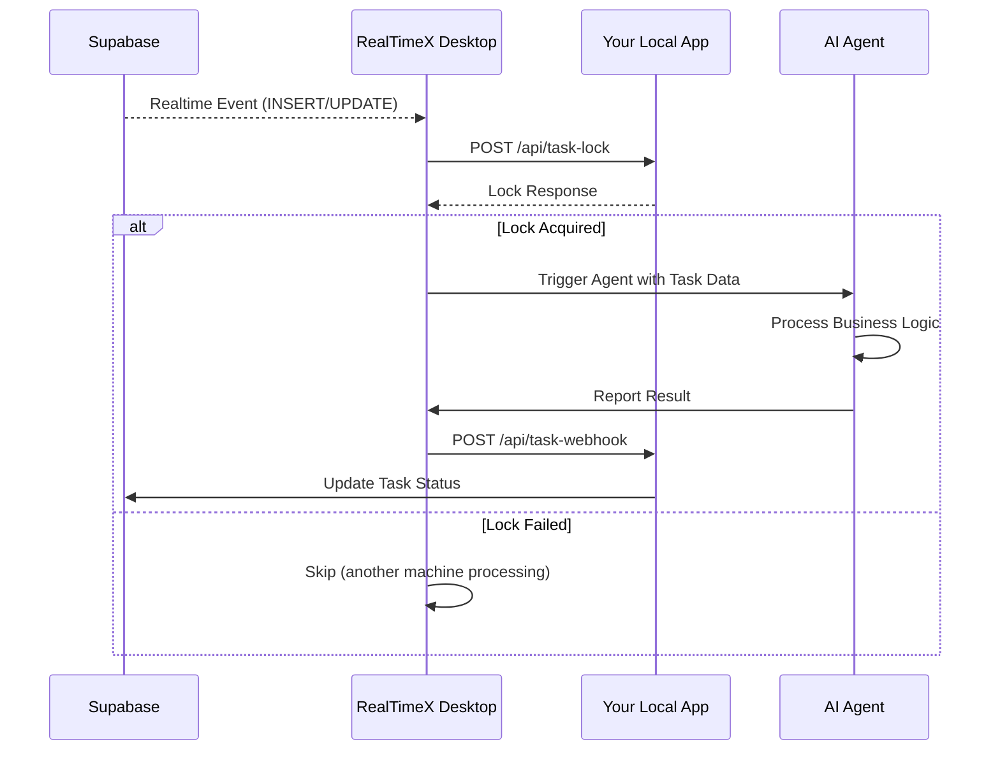

import { Callout, Steps } from 'nextra/components'

# Custom Mode Integration Guide

**Custom Mode** gives you full control over task locking and status management. This mode is ideal for integrating RealTimeX into existing systems, CRM, or ERPs where you want to use your own database tables and custom distribution logic.

## Data Flow Overview

In Custom Mode, your Local App acts as the coordinator for task execution.



---

## 1. Database Requirements

Your existing Supabase table must include (or be altered to include) these columns so RealTimeX can track state:

```sql
-- Required columns for status tracking
ALTER TABLE public.your_table_name 
ADD COLUMN IF NOT EXISTS status TEXT DEFAULT 'pending',          -- pending, claimed, processing, completed, failed
ADD COLUMN IF NOT EXISTS locked_by TEXT,                          -- Machine ID holding the lock
ADD COLUMN IF NOT EXISTS locked_at TIMESTAMP WITH TIME ZONE;      -- When the lock was acquired
ALTER TABLE public.your_table_name
ADD COLUMN IF NOT EXISTS attempted_by TEXT[] DEFAULT '{}',        -- Prevent retry loops
ADD COLUMN IF NOT EXISTS retry_count INTEGER DEFAULT 0,           -- Track attempts
ADD COLUMN IF NOT EXISTS error_message TEXT,                      -- Last error
ADD COLUMN IF NOT EXISTS completed_at TIMESTAMP WITH TIME ZONE,
ADD COLUMN IF NOT EXISTS result JSONB;                            -- Agent execution output
```

---

## 2. API Implementation

Your Local App must implement two HTTP endpoints to handle the coordination.

### Lock API: `POST /api/task-lock`
Called by the RealTimeX Desktop app to request a lock before processing.

**Request:**
```json
{
  "task_id": "uuid",
  "table_name": "string",
  "machine_id": "string",
  "user_email": "string"
}
```

**Response (Success):**
```json
{
  "success": true,
  "locked_by": "machine_id",
  "locked_at": "2024-01-15T10:30:00Z"
}
```

### Webhook API: `POST /api/task-webhook`
Called when an AI Agent completes or fails a task. Use this to update your database record.

**Request:**
```json
{
  "task_id": "uuid",
  "action": "complete", // or "fail"
  "machine_id": "string",
  "table_name": "string",
  "data": {
    "result": { /* agent output */ },
    "error": { "message": "Error description" }
  },
  "timestamp": "2024-01-15T10:35:00Z"
}
```

---

## 3. Realtime Discovery

RealTimeX needs to know which tables are available for Realtime. You MUST create this helper function in your Supabase database:

```sql
CREATE OR REPLACE FUNCTION public.get_publications_full()
RETURNS json
LANGUAGE sql
STABLE
AS $$
WITH publication_tables AS (
  SELECT
    p.pubname,
    n.nspname AS child_schema,
    c.relname AS child_table
  FROM pg_publication p
  LEFT JOIN pg_publication_tables pt ON pt.pubname = p.pubname
  LEFT JOIN pg_class c ON c.relname = pt.tablename
  LEFT JOIN pg_namespace n ON n.oid = c.relnamespace
)
SELECT json_agg(
  jsonb_build_object(
    'pubname', pubname,
    'tables', (
      SELECT json_agg(jsonb_build_object('schema', child_schema, 'table', child_table))
      FROM publication_tables pt2 WHERE pt2.pubname = publication_tables.pubname
    )
  )
)
FROM (SELECT DISTINCT pubname FROM publication_tables) publication_tables;
$$;
```

---

## 4. Stale Lock Recovery

<Callout type="warning">
**CRITICAL:** When RealTimeX is force-quit, tasks remain locked indefinitely in your database. You MUST implement a recovery mechanism.
</Callout>

### Option A: Supabase `pg_cron` (Recommended)
```sql
SELECT cron.schedule(
  'recover-stale-locks-custom',
  '* * * * *',  -- Every minute
  $$
    UPDATE your_table 
    SET status = 'pending', locked_by = NULL, locked_at = NULL
    WHERE status IN ('claimed', 'processing')
      AND locked_at < now() - interval '5 minutes';
  $$
);
```

### Option B: Local App Heartbeat
Implement a background worker in your application that periodically finds and resets stale locks in Supabase.

---

## Next Steps

After implementing your endpoints, head to the [Developer Guide](./) to learn how to use the SDK to interact with your data.
