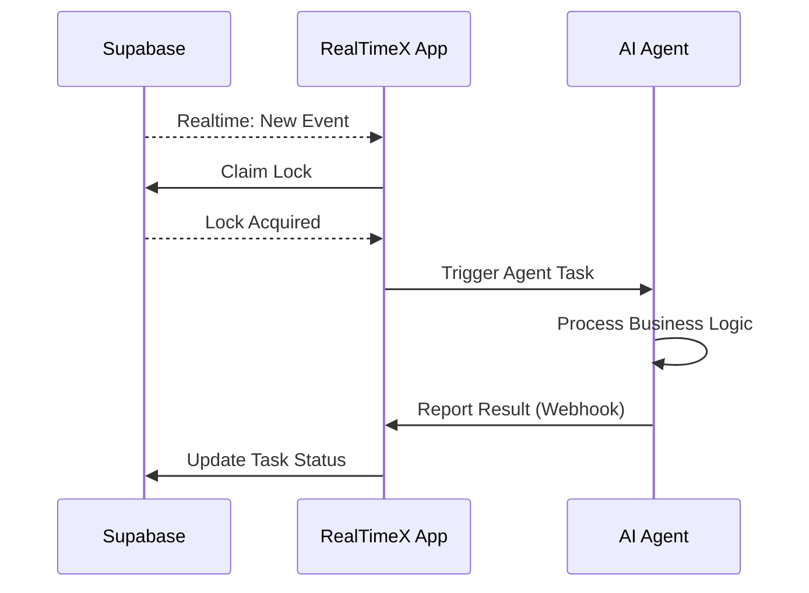

import { Callout } from 'nextra/components'
import Image from 'next/image'

# Local Apps

**Local Apps** is a powerful feature in RealTimeX that enables you to connect local applications running on your machine to the AI Agent system. When events occur in your database (Supabase), RealTimeX can automatically trigger AI Agents to process tasks or create calendar events for manual review.

<Callout type="info">
Local Apps requires **RealTimeX Desktop** (v1.0.53+) and a **Supabase** project with Realtime enabled.
</Callout>

## What is a Local App?

A Local App is an application running on your local machine that integrates with the RealTimeX system. It can:

- **Listen to database events** - Monitor changes in your Supabase database in real-time
- **Trigger AI Agents automatically** - Process tasks immediately when new events occur
- **Create calendar events** - Allow you to review and manually trigger agents when needed
- **Run distributed** - Multiple machines can listen and process tasks simultaneously
- **Ensure reliability** - Lock mechanism prevents duplicate processing

{/*
Uncomment khi đã có screenshot:
<Image
  src="/images/features/local-apps/local-apps-overview.png"
  height={1080}
  width={1920}
  quality={100}
  alt="Local Apps Overview - RealTimeX Desktop"
/>
*/}

## Key Features

### 🔄 Two Operating Modes

#### Compatible Mode (Recommended)
- **One-click setup** - Login to Supabase CLI + Auto-Setup Schema
- **No manual SQL** - RealTimeX creates tables and functions automatically
- **Standard table structure** - Uses the predefined `activities` table
- **Built-in lock logic** - RealTimeX manages everything via RPC functions
- **Best for** - New projects, prototypes, proof of concepts

#### Custom Mode (For developers)
- **Medium complexity** - Requires implementing API endpoints
- **Flexible schema** - Use your existing database tables
- **Custom lock logic** - Your Local App controls the locking mechanism
- **Best for** - Existing systems, CRM, ERP integrations

### 🔒 Distributed Lock Mechanism

The lock mechanism ensures that when multiple machines are listening:
- Only **one machine processes each task**
- Other machines wait for the next available task
- **Stale lock recovery** handles crashed processes
- No duplicate processing or race conditions

### 📊 Real-time Event Processing



## Use Cases

### Automation Examples

1. **Customer Support Automation**
   - New support ticket arrives in database
   - AI Agent automatically categorizes and drafts response
   - Result saved back to database

2. **Content Processing**
   - User uploads a document
   - AI Agent extracts key information
   - Structured data stored in your CRM

3. **Order Processing**
   - New order created
   - AI Agent validates order details
   - Triggers fulfillment workflow

4. **Data Enrichment**
   - New contact added to database
   - AI Agent researches and enriches profile
   - Updates contact with additional information

## System Architecture

### Components

| Component | Role |
|-----------|------|
| **Supabase** | Database + Realtime events, stores task data |
| **RealTimeX Desktop** | Listens to events, coordinates locking, triggers agents |
| **AI Agent** | Processes business logic, returns results via webhook |
| **Local App** | (Custom Mode only) Manages lock logic and custom tables |

### Workflow

1. **Event Detection** - Supabase emits a realtime event (INSERT/UPDATE)
2. **Lock Acquisition** - RealTimeX attempts to claim the task
3. **Agent Execution** - If lock succeeds, AI Agent is triggered
4. **Result Reporting** - Agent reports completion or error via webhook
5. **Status Update** - Final task status updated in database

## Getting Started

### Prerequisites

- **RealTimeX Desktop** v1.0.53 or higher
- **Supabase Account** with an active project
- **Supabase Credentials**:
  - Project URL
  - Anon Key (or Publishable Key)
- **Realtime enabled** for your tables

### Compatible Mode Setup

<Callout type="info">
Compatible Mode is the fastest way to get started. RealTimeX now automatically sets up your Supabase database - **no manual SQL required!**
</Callout>

#### Step 1: Configure Your Local App

1. Open **RealTimeX Desktop** → **Settings** → **Local Apps**
2. Create or edit your Local App
3. Enter your **Supabase URL** and **Anon Key**
4. Select **Compatible Mode**

{/*
Uncomment khi đã có screenshot:
<Image
  src="/images/features/local-apps/compatible-mode-config.png"
  height={1080}
  width={1920}
  quality={100}
  alt="Compatible Mode Configuration"
/>
*/}

#### Step 2: Login to Supabase via CLI

1. Click **Login to Supabase** button
2. A browser window will open for Supabase authentication
3. Complete the OAuth login in your browser
4. Copy the **8-character verification code** displayed
5. Paste the code into RealTimeX and click **Verify**

<Callout type="success">
**Multi-Account Support**: Use the **Switch Account** button to login with a different Supabase account if needed.
</Callout>

{/*
Uncomment khi đã có screenshot:
<Image
  src="/images/features/local-apps/cli-login-flow.png"
  height={1080}
  width={1920}
  quality={100}
  alt="Supabase CLI Login Flow"
/>
*/}

#### Step 3: Auto-Setup Schema

Once authenticated, click **Auto-Setup Schema** to automatically create:

- **`activities` table** with all required columns
- **RPC functions** for task claiming, completion, and failure handling
- **Indexes** for optimal performance
- **Realtime publication** for your tables

<Callout type="warning">
**Project Access Required**: Make sure your Supabase account has write access to the project. If you see an "Access Denied" error, you'll be prompted to switch accounts.
</Callout>

#### What Gets Created

The Auto-Setup creates the following database objects:

**`activities` Table:**

| Column | Type | Description |
|--------|------|-------------|
| `id` | UUID | Primary key, auto-generated |
| `raw_data` | JSONB | Event data (new record) |
| `old_data` | JSONB | Previous data (for updates) |
| `status` | TEXT | pending, claimed, completed, failed |
| `locked_by` | TEXT | Machine ID holding the lock |
| `locked_at` | TIMESTAMP | When lock was acquired |
| `completed_at` | TIMESTAMP | When task completed |
| `error_message` | TEXT | Error details if failed |
| `attempted_by` | TEXT[] | Machines that attempted this task |
| `retry_count` | INTEGER | Number of retry attempts |
| `result` | JSONB | Agent output |
| `created_at` | TIMESTAMP | Record creation time |

**RPC Functions:**

- `claim_task_compatible()` - Securely claim a task with lock
- `complete_task_compatible()` - Mark task as completed with result
- `fail_task_compatible()` - Mark task as failed, release lock
- `get_publications_full()` - Query realtime publications

#### (Optional) Stale Lock Recovery

<Callout type="warning">
When RealTimeX crashes or is force-quit, tasks may remain stuck in `claimed` status. Enable automatic stale lock recovery using `pg_cron`.
</Callout>

Run this SQL in your **Supabase SQL Editor** to enable automatic cleanup:

```sql
-- Enable pg_cron extension (Database > Extensions > pg_cron > Enable)
CREATE EXTENSION IF NOT EXISTS pg_cron;

-- Create cleanup function
CREATE OR REPLACE FUNCTION public.unlock_stale_locks()
RETURNS void AS $$
BEGIN
  UPDATE public.activities
  SET
    status = 'pending',
    locked_by = NULL,
    locked_at = NULL
  WHERE (status = 'claimed' OR status = 'processing')
    AND locked_at < now() - INTERVAL '5 minutes';
END;
$$ LANGUAGE plpgsql;

-- Schedule to run every minute
SELECT cron.schedule(
  'scavenge-stale-locks',
  '* * * * *',
  'SELECT public.unlock_stale_locks();'
);
```

### Manual Setup (Alternative)

If you prefer to run SQL manually or the Auto-Setup fails, you can view the raw script contents [here](https://github.com/therealtimex/RealTimeX/blob/desktop/linux_installer.sh).

### Custom Mode Setup

<Callout type="warning">
Custom Mode requires implementing API endpoints in your Local App. This is for advanced users with existing systems.
</Callout>

#### Required Table Columns

Your custom table must include:

| Column | Type | Description |
|---|---|---|
| `status` | TEXT | pending, claimed, processing, completed, failed |
| `locked_by` | TEXT | Machine ID holding the task |
| `locked_at` | TIMESTAMP | When lock was acquired |

#### Required API Endpoints

Your Local App must implement two endpoints:

**1. Lock API: `POST /api/task-lock`**

```json
// Request
{
  "task_id": "uuid",
  "table_name": "string",
  "machine_id": "string",
  "user_email": "string"
}

// Response (Success)
{
  "success": true,
  "locked_by": "machine_id",
  "locked_at": "2024-01-15T10:30:00Z"
}

// Response (Failure)
{
  "success": false,
  "reason": "already_locked",
  "locked_by": "other_machine_id"
}
```

**2. Webhook API: `POST /api/task-webhook`**

```json
// Complete Request
{
  "task_id": "uuid",
  "action": "complete",
  "machine_id": "string",
  "data": { "result": { /* agent output */ } }
}

// Fail Request
{
  "task_id": "uuid",
  "action": "fail",
  "machine_id": "string",
  "data": { "error": { "message": "Error description" } }
}
```

### Configure in RealTimeX Desktop

1.  Open **Settings** → **Local Apps**

{/*
Uncomment khi đã có screenshot Settings page:
<Image
  src="/images/features/local-apps/settings-page.png"
  height={1080}
  width={1920}
  quality={100}
  alt="Local Apps Settings Page"
/>
*/}

2.  Click **Create New Local App**

{/*
Uncomment khi đã có screenshot Create form:
<Image
  src="/images/features/local-apps/create-local-app.png"
  height={1080}
  width={1920}
  quality={100}
  alt="Create New Local App Form"
/>
*/}
3.  Fill in the details:
    - **Display Name**: Give your app a name
    - **Description**: Optional description
    - **App Type**: Select app type (if applicable)
    - **Icon**: Upload an optional icon
4.  Enable **Enable Subscription**
5.  Enter your **Supabase URL** and **Anon Key**
6.  Select **Mode**: Compatible or Custom
7.  Select **Tables** to monitor
8.  Click **Save**

## Advanced Configuration

### App Types

RealTimeX supports multiple app types for different runtime environments:

| Type | Description | Example Use Case | Command Example |
|---|---|---|---|
| **python** | Python scripts/servers | Data processing, ML models | `python app.py` |
| **node** | Node.js applications | Web servers, APIs | `node server.js` |
| **npx** | NPX packages (Node) | Quick prototyping, tools | `npx create-agent` |
| **uvx** | Python UVX packages | Modern Python tools | `uvx my-package` |
| **custom** | Custom executables | Compiled binaries, scripts | `/path/to/binary` |

**Configuration Example:**

```json
{
  "name": "my-python-agent",
  "display_name": "Python Data Processor",
  "app_type": "python",
  "config": {
    "command": "python",
    "args": ["app.py"],
    "working_dir": "/path/to/project",
    "env": {
      "PYTHONPATH": "/path/to/libs",
      "DEBUG": "true"
    }
  }
}
```

### Agent Handlers Configuration

Agent Handlers define which AI agents process events from specific tables. This allows you to route different types of data to different specialized agents.

**Configuration Structure:**

```json
{
  "config": {
    "agentHandlers": [
      {
        "tableName": "activities",
        "agentId": "customer-support-agent",
        "eventTypes": ["INSERT", "UPDATE"]
      },
      {
        "tableName": "orders",
        "agentId": "order-processing-agent",
        "eventTypes": ["INSERT"]
      }
    ]
  }
}
```

**Example: Multi-Agent Setup**

```json
{
  "agentHandlers": [
    {
      "tableName": "support_tickets",
      "agentId": "support-categorizer",
      "eventTypes": ["INSERT"],
      "description": "Categorize new support tickets"
    },
    {
      "tableName": "documents",
      "agentId": "document-analyzer",
      "eventTypes": ["INSERT", "UPDATE"],
      "description": "Extract data from uploaded documents"
    },
    {
      "tableName": "contacts",
      "agentId": "contact-enricher",
      "eventTypes": ["INSERT"],
      "description": "Enrich contact information"
    }
  ]
}
```

<Callout type="info">
**Agent ID**: The `agentId` must match an existing AI Agent configured in your RealTimeX workspace. You can find agent IDs in **Settings** → **AI Agents**.
</Callout>

### Table Actions Filtering

Control which database event types trigger task processing for each table. This helps optimize performance and avoid unnecessary processing.

**Default Behavior:**
Without filtering, all event types (INSERT, UPDATE, DELETE) will trigger processing.

**Configuration:**

```json
{
  "config": {
    "supabase": {
      "tables": ["public.activities", "public.orders"],
      "tableActions": {
        "public.activities": ["INSERT", "UPDATE"],
        "public.orders": ["INSERT"],
        "public.contacts": ["INSERT"]
      }
    }
  }
}
```

**Use Cases:**

- **INSERT only**: Process new records (e.g., new orders, new contacts)
- **UPDATE only**: React to status changes (e.g., order status updates)
- **INSERT + UPDATE**: Full lifecycle monitoring (e.g., support tickets)

**Performance Tip:** Filtering at the subscription level reduces unnecessary event processing and improves performance.

### Concurrency Control

Control how many tasks a Local App can process simultaneously to optimize resource usage.

**Configuration:**

```json
{
  "config": {
    "supabase": {
      "max_concurrent_tasks": 3
    }
  }
}
```

**How it Works:**

1.  **Default**: `max_concurrent_tasks = 1` (sequential processing)
2.  **Concurrent**: Set higher values for parallel processing
3.  **Task Queue**: When limit is reached, new tasks wait in the calendar
4.  **Resource Control**: Prevents overwhelming your system with too many simultaneous tasks

**Example Scenarios:**

| Use Case | Recommended Setting | Reason |
|---|---|---|
| CPU-intensive tasks | 1-2 | Avoid CPU overload |
| I/O-bound tasks (API calls) | 3-5 | Maximize throughput |
| Database queries | 2-3 | Balance DB connections |
| Simple automation | 1 | Ensure order preservation |

<Callout type="warning">
**Important**: Higher concurrency increases resource usage (CPU, memory, database connections). Monitor your system and adjust accordingly.
</Callout>

### Supabase Filters

Apply filters to only process specific rows from your tables.

**Configuration:**

```json
{
  "config": {
    "supabase": {
      "tables": ["public.activities"],
      "filter": "status=eq.pending"
    }
  }
}
```

**Filter Syntax:**
Uses Supabase PostgREST filter syntax:
- `column=eq.value` - Equals
- `column=neq.value` - Not equals
- `column=gt.value` - Greater than
- `column=gte.value` - Greater than or equal
- `column=lt.value` - Less than
- `column=lte.value` - Less than or equal

**Example Filters:**

```json
{
  "filter": "priority=eq.high"           // Only high priority
}
{
  "filter": "status=eq.pending"          // Only pending tasks
}
{
  "filter": "user_id=eq.123"             // Specific user
}
```

## Advanced Features

### Startup Recovery (Auto-Sweep)

When RealTimeX Desktop starts, it automatically scans for tasks that occurred while your machine was offline. This ensures no tasks are lost.

**How It Works:**

1.  **On Startup**: RealTimeX queries Supabase for pending/failed tasks
2.  **Deduplication**: Checks if task already exists locally to avoid duplicates
3.  **Processing**: Creates calendar events or triggers agents for missed tasks
4.  **Limit**: Processes up to 50 most recent tasks per table

**What Gets Recovered:**

- Tasks in `pending` status
- Tasks in `failed` status (for retry)
- Tasks created while your machine was offline or shut down

**Example Log:**

```
[LocalAppsManager] Startup sweep for 'customer-support'
[LocalAppsManager] Found 3 pending tasks in 'support_tickets'
[LocalAppsManager] Created 3 calendar events for review
```

<Callout type="success">
**No Configuration Needed**: Startup recovery is automatic for all Local Apps with Supabase subscription enabled.
</Callout>

### Heartbeat Mechanism

For long-running tasks, RealTimeX sends periodic heartbeat updates to prevent lock timeouts.

**How It Works:**

1.  **Task Claimed**: Lock acquired with `locked_at` timestamp
2.  **Heartbeat**: Every 2 minutes, `locked_at` is refreshed
3.  **Timeout Protection**: Prevents stale lock cleanup while task is actively processing
4.  **Auto-Stop**: Heartbeat stops when task completes or fails

**Configuration:**

Heartbeat is **automatic** for all tasks. The default timeout is **5 minutes** of inactivity.

**Example Timeline:**

```
00:00 - Task claimed (locked_at: 00:00)
02:00 - Heartbeat (locked_at: 02:00) ✓
04:00 - Heartbeat (locked_at: 04:00) ✓
06:00 - Heartbeat (locked_at: 06:00) ✓
08:00 - Task completes, heartbeat stops
```

<Callout type="info">
**Long Tasks**: If your agent takes longer than 5 minutes, heartbeat ensures the lock stays active. Without heartbeat, the task would be marked as stale and reassigned.
</Callout>

### Presence Tracking

RealTimeX tracks which machines are online and processing tasks in real-time using Supabase Presence.

**What Gets Tracked:**

- **Machine ID**: Unique identifier for each machine
- **User Email**: Who is running the Local App
- **Hostname**: Computer name
- **App Name**: Which Local App is running
- **Online Status**: Last seen timestamp

**How to View:**

Open **Settings** → **Local Apps** → **Subscription Monitor** to see all connected machines.

**Use Cases:**

1.  **Distributed Teams**: See which team member's machine is processing tasks
2.  **Load Balancing**: Identify if one machine is overloaded
3.  **Debugging**: Check if a specific machine is online and listening
4.  **Auditing**: Track who processed which tasks

**Example Presence Data:**

```json
{
  "machine_id": "mac-a1b2c3d4",
  "user_email": "john@example.com",
  "hostname": "Johns-MacBook-Pro",
  "app_name": "customer-support",
  "online_at": "2024-01-15T10:30:00Z"
}
```

### Retry Mechanism

When a task fails, RealTimeX implements an intelligent retry system with machine tracking.

**How It Works:**

1.  **Task Fails**: Agent reports error via webhook
2.  **Machine Tracking**: Failed machine ID added to `attempted_by` array
3.  **Lock Release**: Task status set to `failed`, lock released
4.  **Retry Prevention**: Failed machine won't retry immediately (prevents infinite loops)
5.  **Other Machines**: Other machines can claim and retry the task

**Database Fields:**

```sql
-- Fields used for retry tracking
attempted_by TEXT[] DEFAULT '{}'  -- Machines that failed this task
retry_count INTEGER DEFAULT 0     -- Number of retry attempts
error_message TEXT                -- Last error message
```

**Example Flow:**

```
Machine A: Claims task → Fails (network error)
  → attempted_by = ['machine-a']
  → retry_count = 1
  → status = 'failed'

Machine B: Claims task → Succeeds
  → status = 'completed'
```

**Compatible Mode Auto-Retry:**

The `claim_task_compatible` function automatically prevents retry loops:

```sql
WHERE id = target_task_id
  AND NOT (machine_id = ANY(attempted_by))  -- Skip if already tried
```

<Callout type="warning">
**Retry Limit**: After 3 failed attempts from different machines, consider investigating the root cause. The task may have data issues. ➤ Please open a <a href="https://github.com/therealtimex/RealTimeX/issues" target="_blank">Github Issue</a> if you have installation or bootup troubles.
</Callout>

## End-to-End Example

Let's build a complete customer support automation system from scratch.

### Scenario: Auto-Categorize Support Tickets

**Goal**: When a new support ticket is created in Supabase, automatically categorize it using AI and update the database.

### Step 1: Supabase Setup

```sql
-- Create support tickets table
CREATE TABLE public.support_tickets (
  id UUID NOT NULL DEFAULT gen_random_uuid(),
  customer_email TEXT NOT NULL,
  subject TEXT NOT NULL,
  message TEXT NOT NULL,
  category TEXT NULL,           -- Will be filled by AI
  priority TEXT NULL,            -- Will be filled by AI
  status TEXT DEFAULT 'pending',
  locked_by TEXT NULL,
  locked_at TIMESTAMP WITH TIME ZONE NULL,
  created_at TIMESTAMP WITH TIME ZONE DEFAULT now(),
  CONSTRAINT support_tickets_pkey PRIMARY KEY (id)
);

-- Enable Realtime
ALTER TABLE public.support_tickets REPLICA IDENTITY FULL;
ALTER PUBLICATION supabase_realtime ADD TABLE public.support_tickets;

-- Create indexes
CREATE INDEX idx_tickets_status ON public.support_tickets(status);
```

### Step 2: Create AI Agent

In RealTimeX:

1. Go to **Settings** → **AI Agents** → **Create New Agent**
2. Configure agent:
   - **Name**: `support-ticket-categorizer`
   - **System Prompt**:
   ```
   You are a support ticket categorizer. Analyze the ticket and return:
   {
     "category": "technical|billing|general",
     "priority": "low|medium|high",
     "summary": "Brief summary of the issue"
   }
   ```
3. Save the agent

### Step 3: Create Local App

1. Go to **Settings** → **Local Apps** → **Create New Local App**
2. Configure:
   - **Display Name**: Support Ticket Processor
   - **App Type**: `custom` (no executable needed, just subscription)
   - **Enable Subscription**: ✓
   - **Supabase URL**: Your Supabase URL
   - **Anon Key**: Your Supabase anon key
   - **Mode**: Compatible
   - **Tables**: `public.support_tickets`

3. Add to app configuration (via API or config file):

```json
{
  "config": {
    "supabase": {
      "enabled": true,
      "mode": "compatible",
      "tables": ["public.support_tickets"],
      "tableActions": {
        "public.support_tickets": ["INSERT"]
      },
      "max_concurrent_tasks": 2
    },
    "agentHandlers": [
      {
        "tableName": "support_tickets",
        "agentId": "support-ticket-categorizer",
        "eventTypes": ["INSERT"]
      }
    ]
  }
}
```

### Step 4: Create Agent Script

Create `categorize-agent.js`:

```javascript
const fetch = require('node-fetch');

/**
 * Support Ticket Categorizer Agent
 *
 * RealTimeX automatically calls this agent when a new ticket is created.
 * The agent receives data via environment variables or command line args.
 */

async function main() {
  try {
    // Get task data from environment (passed by RealTimeX)
    const taskUuid = process.env.TASK_UUID;
    const activityData = JSON.parse(process.env.ACTIVITY_DATA || '{}');
    const ticket = activityData.raw_data;

    console.log('Processing ticket:', ticket.id);

    // Step 1: Analyze ticket using AI
    const analysis = await analyzeTicket(ticket);
    console.log('Analysis complete:', analysis);

    // Step 2: Update ticket in Supabase with results
    await updateTicket(ticket.id, analysis);
    console.log('Ticket updated in database');

    // Step 3: Report success back to RealTimeX
    await reportWebhook(taskUuid, 'completed', {
      result: analysis,
      ticket_id: ticket.id
    });

    console.log('Task completed successfully');
    process.exit(0);

  } catch (error) {
    console.error('Error processing ticket:', error);

    // Report failure back to RealTimeX
    const taskUuid = process.env.TASK_UUID;
    if (taskUuid) {
      await reportWebhook(taskUuid, 'failed', {
        error: {
          message: error.message,
          stack: error.stack
        }
      });
    }

    process.exit(1);
  }
}

async function analyzeTicket(ticket) {
  // TODO: Replace with actual AI call (OpenAI, Claude, etc.)

  // Example: Call OpenAI
  const openai = require('openai');
  const client = new openai.OpenAI({ apiKey: process.env.OPENAI_API_KEY });

  const response = await client.chat.completions.create({
    model: 'gpt-4',
    messages: [
      {
        role: 'system',
        content: 'You are a support ticket categorizer. Analyze the ticket and return JSON with category (technical|billing|general) and priority (low|medium|high).'
      },
      {
        role: 'user',
        content: `Subject: ${ticket.subject}\n\nMessage: ${ticket.message}`
      }
    ],
    response_format: { type: 'json_object' }
  });

  return JSON.parse(response.choices[0].message.content);
}

async function updateTicket(ticketId, analysis) {
  const SUPABASE_URL = process.env.SUPABASE_URL;
  const SUPABASE_KEY = process.env.SUPABASE_KEY;

  const response = await fetch(
    `${SUPABASE_URL}/rest/v1/support_tickets?id=eq.${ticketId}`,
    {
      method: 'PATCH',
      headers: {
        'apikey': SUPABASE_KEY,
        'Authorization': `Bearer ${SUPABASE_KEY}`,
        'Content-Type': 'application/json',
        'Prefer': 'return=minimal'
      },
      body: JSON.stringify({
        category: analysis.category,
        priority: analysis.priority,
        status: 'categorized'
      })
    }
  );

  if (!response.ok) {
    throw new Error(`Failed to update ticket: ${response.statusText}`);
  }
}

async function reportWebhook(taskUuid, action, data) {
  const webhookUrl = `http://localhost:3001/api/external-tasks/${taskUuid}/webhook`;

  const response = await fetch(webhookUrl, {
    method: 'POST',
    headers: { 'Content-Type': 'application/json' },
    body: JSON.stringify({
      action: action,
      table_name: 'support_tickets',
      machine_id: process.env.MACHINE_ID || 'unknown',
      data: data
    })
  });

  if (!response.ok) {
    throw new Error(`Webhook failed: ${response.statusText}`);
  }
}

// Run the agent
main();
```

**Key Points:**

1. **RealTimeX handles coordination**: You don't need to listen for events
2. **Environment variables**: Task data is passed via `TASK_UUID` and `ACTIVITY_DATA`
3. **Three steps**: Analyze → Update Database → Report back via webhook
4. **Error handling**: Always report failures so RealTimeX can retry on another machine

**Alternative: Using Command Line Args**

If your agent receives data via CLI args instead:

```javascript
// Parse command line arguments
const args = process.argv.slice(2);
const taskUuid = args[0];
const activityDataJson = args[1];
const activityData = JSON.parse(activityDataJson);
```

### Step 5: Test the System

1. **Start RealTimeX Desktop**
2. **Insert a test ticket**:

```sql
INSERT INTO public.support_tickets (customer_email, subject, message)
VALUES ('customer@example.com', 'Cannot connect to database', 'I am getting connection timeout errors');
```

3. **Check Calendar**: You should see a calendar event created
4. **Check Database**: After processing, ticket should have `category` and `priority` filled

### Step 6: Monitor

- **View Logs**: Settings → Local Apps → View Logs
- **Check Presence**: See which machines are online
- **Monitor Tasks**: Check Calendar for task status
- **Database**: Query `support_tickets` for results

**Expected Flow:**

```
1. User creates ticket in Supabase
   ↓
2. RealTimeX receives INSERT event
   ↓
3. Creates calendar event
   ↓
4. Claims task (lock acquired)
   ↓
5. Triggers support-ticket-categorizer agent
   ↓
6. Agent analyzes ticket with AI
   ↓
7. Agent updates Supabase with category/priority
   ↓
8. Agent reports success via webhook
   ↓
9. Task marked as completed
```

<Callout type="success">
**Congratulations!** You now have a fully automated support ticket categorization system. Scale it by adding more agent handlers for different workflows.
</Callout>

## Best Practices

### 1. Implement Stale Lock Recovery

Always implement stale lock recovery to handle unexpected crashes:
- Use **pg_cron** for database-level recovery (recommended)
- Or implement server-side cleanup with Node.js/Python
- Set timeout to **5 minutes** for safety

### 2. Handle Errors Gracefully

Your AI Agent should:
- Catch and log all errors
- Report failures via webhook
- Include meaningful error messages
- Avoid infinite retry loops

### 3. Monitor Your Tasks

- Check the **Calendar** view in RealTimeX to see task events

{/*
Uncomment khi đã có screenshot Calendar:
<Image
  src="/images/features/local-apps/task-calendar.png"
  height={1080}
  width={1920}
  quality={100}
  alt="Task Calendar View - Monitoring Local App Tasks"
/>
*/}

- Monitor task status in your database
- Set up alerts for failed tasks
- Review error messages regularly

### 4. Optimize Performance

- Add database indexes on frequently queried columns
- Use `REPLICA IDENTITY FULL` for UPDATE event tracking
- Limit the number of concurrent tasks
- Consider batching operations

### 5. Secure Your Credentials

- Never commit Supabase keys to version control
- Use environment variables for sensitive data
- Rotate keys periodically
- Use Row Level Security (RLS) in Supabase

## Troubleshooting

### Tasks Getting Stuck

**Problem**: Tasks remain in `claimed` status indefinitely

**Solution**:
1. Verify stale lock recovery is set up (pg_cron or server-side)
2. Manually reset stuck tasks:
   ```sql
   UPDATE activities
   SET status = 'pending', locked_by = NULL, locked_at = NULL
   WHERE status = 'claimed' AND locked_at < now() - INTERVAL '5 minutes';
   ```

### Multiple Machines Processing Same Task

**Problem**: Two machines process the same task

**Solution**:
- Ensure your lock logic uses safe, concurrent operations
- Verify `claim_task_compatible` function is correctly implemented
- Check that `machine_id` is unique per machine

### Agent Not Triggering

**Problem**: Database events don't trigger AI Agents

**Solution**:
1. Verify Realtime is enabled: `ALTER PUBLICATION supabase_realtime ADD TABLE your_table;`
2. Check that the table is selected in Local App settings
3. Verify the Local App is running (check status in Settings)
4. Review Event Logs for errors

### Webhook Failures

**Problem**: Agent results not saving to database

**Solution**:
- Ensure RealTimeX is running on port 3001 for webhooks
- Check firewall settings allow localhost connections
- Verify webhook URL is correctly configured
- Review agent logs for connection errors

## FAQ

### Can multiple machines run simultaneously?

Yes! The lock mechanism ensures only one machine processes each task. Other machines will wait for the next available task.

### Which mode should I choose?

- **Compatible Mode**: Best for new projects, prototypes, learning
- **Custom Mode**: Best for existing systems, when you need custom table structure

### What happens if my app crashes?

Tasks being processed will remain stuck in `claimed` status until:
- Stale lock recovery (pg_cron) resets them after 5 minutes
- You manually reset them via SQL
- Another machine claims stale locks

### How do I see tasks being processed?

Open the **Calendar** in the workspace menu. All task events will appear there.

### Can I use this with non-Supabase databases?

Not directly. Local Apps currently requires Supabase for:
- Realtime event streaming
- RPC function execution (Compatible Mode)
- Table publication queries

## Additional Resources

- [Using AI Agents](/agent/overview) - Learn how to create and configure AI Agents
- [Agent Builder](/agent-builder) - Build complex workflows with Agent Builder
- [API Access](/features/api) - Integrate RealTimeX with external services
- [Developer Guide](/local-apps/developer-guide) - Build your own Local App
- [Agent Developer](/local-apps/agent-developer) - Create AI agents for task processing
- [Supabase Documentation](https://supabase.com/docs) - Official Supabase guides

---

<Callout type="success">
Ready to automate your workflows? Start with Compatible Mode and create your first Local App!
</Callout>
